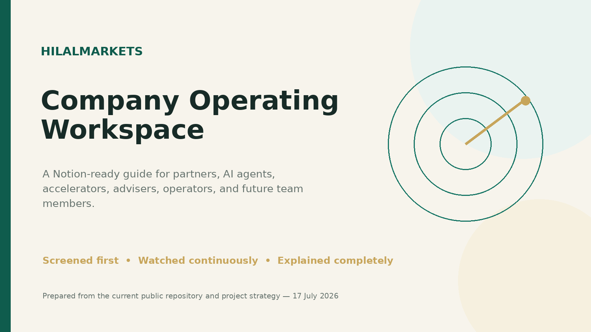
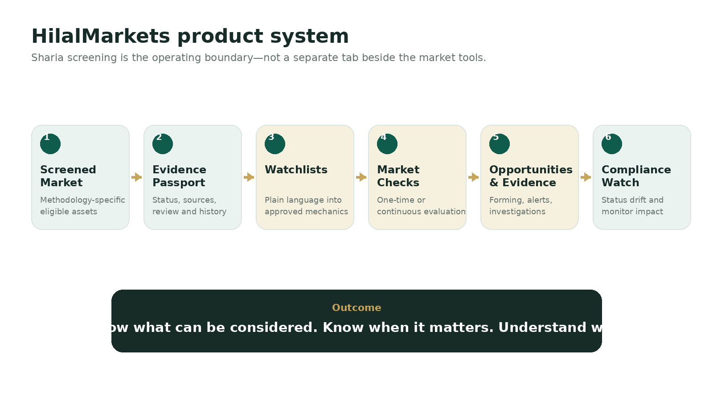

# 🏠 HilalMarkets HQ

> **Workspace status:** Updated 17 July 2026. Product name: **HilalMarkets**.

> **One-line definition:** Sharia-screened crypto spot intelligence and evidence-led market monitoring for self-directed Muslim investors.

## Start here

| Reader | First pages |
|---|---|
| New partner or adviser | [Company Overview](01_Company_Overview.md) → [Partner Onboarding](15_Partner_Onboarding.md) → [Governance](05_Sharia_Governance_and_Evidence.md) |
| Accelerator or investor | [Company Overview](01_Company_Overview.md) → [Business Model](08_Business_Model_and_Pricing.md) → [Accelerators](11_Accelerator_and_Fundraising.md) → [Metrics](12_Metrics_and_Experiments.md) |
| Product or engineering contributor | [Product System](03_Product_System_and_Features.md) → [Architecture](07_Technology_Architecture.md) → [Roadmap](18_Roadmap_and_Priorities.md) |
| AI agent | [AI Agent Master Context](16_AI_Agent_Master_Context.md) → [Brand Voice](17_Brand_Voice_and_Messaging.md) → [Sources](20_Sources_and_Evidence.md) |
| Operations or support | [Operations](14_Operations_and_Launch.md) → [Risk](13_Risk_Security_and_Legal.md) → [Glossary](19_Glossary.md) |

## The business in one paragraph

HilalMarkets is a subscription platform that combines a **Sharia-screened market**, transparent **Evidence Passports**, guided **Watchlists**, one-time market checks, continuous deterministic monitoring, **Opportunities & Evidence**, and **Compliance Changes**. Users choose the methodology and market behavior they care about; HilalMarkets structures the mechanics, checks only policy-allowed spot assets, and preserves the exact evidence behind every opportunity, alert, exclusion, and later status change. The platform does not place trades and does not allow AI to issue or publish religious decisions.

## Current truth

### ✅ Implemented in the public repository
- HilalMarkets public and dashboard identity, navigation, emerald/ivory/gold UI system, dedicated public pages, metadata, sitemap, consent controls, and help/legal surfaces.
- Sharia-first data models, fail-closed universe resolution, Screened Market, Saved Assets, Evidence Passport, methodology views, compliance changes, and customer activity.
- Guided AI Setup Chat compiled into a validated strategy DSL; explicit approval before activation.
- Deterministic scanning, condition evidence, opportunity journeys, alert proof, and “Why didn’t this alert happen?” forensics.
- Telegram and Discord application layers, billing adapters, checkout records, payment-email outbox, support, audit history, and System Brain administration.
- Human review/publication separation, optional four-eyes enforcement, historical Passport binding, SLA/assignment fields, correction paths, and audit export.

### ⚠️ Operationally gated before a trustworthy public Sharia launch
- A real qualified methodology and governing authority.
- Qualified reviewer assignments, service levels, source licensing, and evidence operations.
- Reviewed and published production assets; the software intentionally fails closed without them.
- Production Cloudflare Access and direct-origin firewall protection.
- Staging validation of real market-data, Telegram, email, and payment-provider flows.
- Final legal review of Terms, Privacy, Risk Disclosure, Cookies, financial promotion, and jurisdiction-specific boundaries.
- Real private-beta traction and retention evidence.

## Product principle

> **Screened first → watched continuously → explained completely.**

## Current top priorities

1. Establish qualified Sharia governance and approve a production methodology.
2. Publish a small evidence-complete pilot asset set through the real review workflow.
3. Move the verified deployment to HilalMarkets.com and remove remaining legacy deployment references.
4. Run a complete staging golden path with real providers.
5. Recruit private-beta users from the guided active Muslim-investor segment.
6. Measure activation, first successful scan, test-alert delivery, passport engagement, and seven-day retention.
7. Prepare Hub71+ Digital Assets material before the current cohort deadline.

## Core links

- Product domain: `https://hilalmarkets.com`
- GitHub repository: `https://github.com/AmroElzeiny/Trace-Edge`
- [Workspace import guide](README_IMPORT.md)
- [Source and evidence register](20_Sources_and_Evidence.md)
