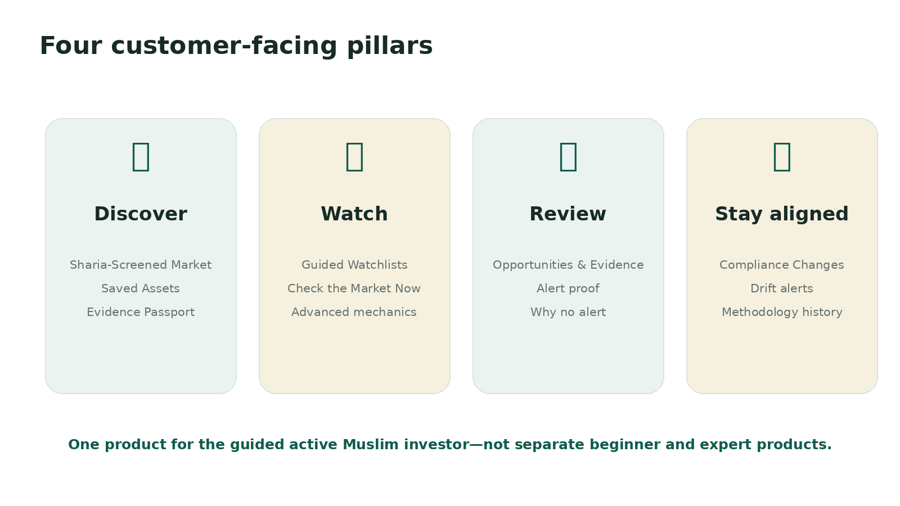

# 🧩 Product System and Features

> **Workspace status:** Updated 17 July 2026. Product name: **HilalMarkets**.

## Customer navigation

### Discover
- **Home:** operational summary and next action.
- **Sharia-Screened Market:** assets allowed by the selected methodology and policy.
- **Saved Assets:** user-approved asset list with current status and evidence freshness.

### Watch
- **Watchlists:** continuous monitoring built from guided conversation or Advanced Controls.
- **Check the Market Now:** one-time evaluation using the same approved mechanics and policy resolver.

### Review
- **Opportunities & Evidence:** forming opportunities, alerts, ended journeys, proof, and investigations.
- **Compliance Changes:** material changes, status drift, impact, and review outcomes.

### Trust
- **How We Screen:** methodology, governance, source boundaries, statuses, and limitations.

### Account
- Integrations, Plan & Billing, Settings, and Support.

## Core features

### 🔎 Sharia-Screened Market
The discovery surface returns only assets permitted by the user’s effective policy. Missing assessments and restricted statuses fail closed. Filters can include methodology, status, exchange, quote asset, liquidity, and opportunity type.

### 🛂 Evidence Passport
Every published asset has a current or historical Passport showing:

- canonical identity and exact exchange mapping;
- methodology and version;
- current or event-time status;
- review and publication dates;
- plain-language meaning and limits;
- use-specific coverage such as spot inclusion, native staking, third-party lending, yield, or derivatives;
- criterion outcomes, qualifications, evidence gaps, and sources;
- audit history and methodology comparison;
- a clear statement that AI-organized factual research is not a religious decision.

The Quick View can open from Screened Market, Saved Assets, opportunity cards, compliance events, Watchlist results, and alert proof.

### 📡 Guided Watchlists
The user explains what to watch in normal language. The system asks for measurable definitions, compiles only into the validated strategy DSL, shows assumptions and coverage, previews recent market data, and creates an immutable approved version only after explicit consent.

Supported universe modes include:

- eligible market;
- approved user watchlist;
- explicit eligible assets.

### ⚡ Check the Market Now
Runs the same approved rules once against the screened universe. It reports included assets, policy exclusions, data failures, forming opportunities, and full matches. It does not create continuous monitoring unless the user chooses to activate a Watchlist.

### 🧭 Opportunity Journeys
A persistent setup instance tracks one opportunity from detection through forming, ready for review, alert sent, ended, or paused for compliance. The system separates **peak readiness** from final state, avoiding misleading combinations such as “100% expired.”

### 🧾 Opportunities & Evidence
A unified activity workspace combines:

- forming opportunities;
- alert proof;
- ended journeys;
- compliance changes;
- missed-alert investigations;
- current versus historical Passport status.

### 🔔 Compliance Changes and Drift Alerts
Material project or source changes create a review case. Depending on configured safety policy, an affected asset can receive an operational under-review hold and be paused from new opportunities while the previous approved record remains historically intact. Users see affected Watchlists and evidence.

### 🧪 Methodology Comparison
Approved methodologies are shown side by side with status, version, review date, reasons, qualifications, and evidence completeness. Results are not averaged into false consensus.

### 🤖 AI Setup Chat
AI assists with language and orchestration, but the backend retains authority. The model cannot approve or activate a Watchlist, change billing, publish a Sharia status, execute code, create arbitrary URLs, or bypass deterministic services.

### 🛠 Dynamic mechanic extension
A bounded expression DSL can create a user-scoped, versioned candle-computable mechanic when it is absent from the registry. The worker validates and tests it; no AI-generated Python is executed.

### 📬 Delivery and integrations
- Telegram webhook delivery and interactive onboarding.
- Discord OAuth, DMs/channels, threads, commands, and paid role synchronization where enabled.
- In-app evidence and compliance notifications.
- Durable retries, deduplication, and delivery history.

### 💳 Commercial system
- Single server-owned plan catalog.
- Free, Core, and Pro are publicly purchasable.
- Stripe and NOWPayments provider adapters plus static/local mode.
- Durable checkout attempts, idempotent webhooks, entitlement changes, downgrade pauses, and payment-email outbox.

### 🧠 System Brain
A hidden administrator workspace for screening research, review, publication, assignments, SLA, source monitoring, delivery health, audit history, and product capability quality. Customer navigation, sitemap, and public discovery exclude it.

## Product boundaries

- Spot monitoring only in the initial product.
- No automatic trade execution.
- No AI-generated religious status.
- No silent fallback from a missing assessment to general market scanning.
- No ticker-only identity matching.
- No rewriting historical evidence when the current status changes.
- No hidden plan purchase through browser-supplied codes or prices.

## Current state labels

| Label | Meaning |
|---|---|
| Implemented | Present in the public repository and covered by repository tests |
| Operationally gated | Requires real configuration, governance, provider, or human review |
| Planned | Strategic expansion not represented as a live user promise |
