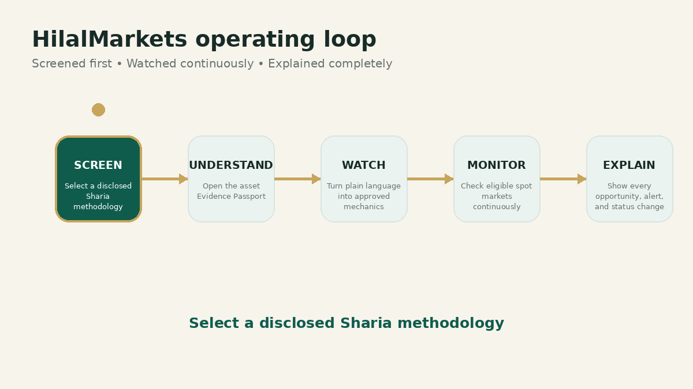
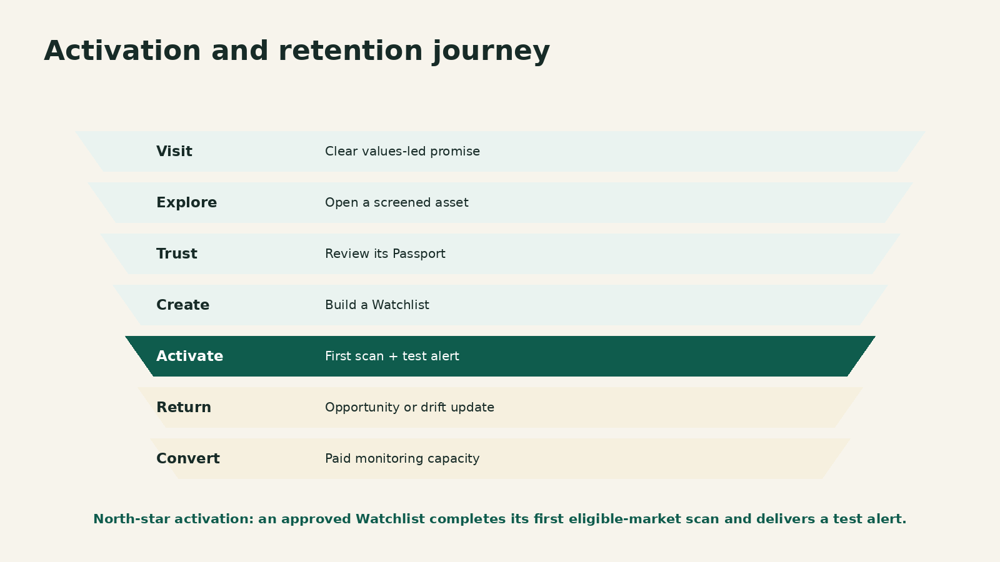

# 🛤️ Customer Journeys and UX

> **Workspace status:** Updated 17 July 2026. Product name: **HilalMarkets**.

## First-session journey

1. **Land on a clear promise**  
   The first viewport identifies the Muslim audience, methodology-specific screening, spot-only scope, evidence-led monitoring, and no-execution boundary.

2. **Verify the account**  
   Keep signup short. After verification, direct a new user toward the Screened Market or guided Watchlist path—not an empty analytics dashboard.

3. **Explore one asset**  
   The user sees its status, review date, methodology, top reasons, important qualifications, and Full Passport action.

4. **Choose what to notice**  
   Guided options:
   - breaking a recent high;
   - pullback in an upward trend;
   - unusual market activity;
   - a specific price level;
   - describe something else.

5. **Review the mechanics**  
   Show what was understood, what needs clarification, exact rules under progressive disclosure, screened universe, and behavior if status changes.

6. **Check the market**  
   Run one safe market check before asking for continuous activation.

7. **Connect delivery**  
   Telegram first. Require a test alert and show delivery success.

8. **Activate the Watchlist**  
   Confirm the methodology, eligible-asset count, schedule, alert timing, and compliance-change behavior.

9. **Deliver the first value**  
   First successful scan, first forming opportunity, or first test alert.

## Activation definition

> A verified user becomes activated when an approved Watchlist completes its first eligible-market scan and the user has a working alert-delivery path.

Signup is not activation.

## Returning-user home

The Home page should answer:

1. Are my Watchlists healthy?
2. What is forming now?
3. Did any alert or compliance status change?
4. What needs my attention?
5. What is the next useful action?

## Opportunity card standard

Every card should show, above the fold:

- asset and pair;
- current Sharia status;
- methodology and review date;
- opportunity type;
- readiness and direction;
- up to three present conditions;
- one main missing requirement;
- primary action: **Watch this** or **View journey**;
- secondary action: **See why** or **Open chart**.

Example:

> **SOL/USDT — Eligible**  
> Breaking a recent high  
> **80% ready · Getting closer**  
> Present: price near the high; activity stronger; larger trend positive  
> Still missing: price has not closed above the high  
> Reviewed under Methodology X, version Y

## Engagement loops

### Market loop
Screened Market → opportunity → Watchlist → alert → evidence → refine Watchlist.

### Trust loop
Passport → source/review detail → save asset → status change → updated Passport.

### Learning loop
Plain-language request → clarified mechanics → market result → explanation → better future request.

### Retention loop
Active Watchlist → forming opportunity → delivered alert → investigation → continued monitoring.

## UX principles

- One primary action per major state.
- Beginner language first; exact mechanics under Advanced Controls.
- No empty dashboards full of zeros during onboarding.
- Status color carries meaning; decoration does not.
- Motion explains state change and supports reduced-motion preferences.
- Every failure includes a cause, user impact, and next action.
- Historical event evidence is immutable and clearly separated from current status.
