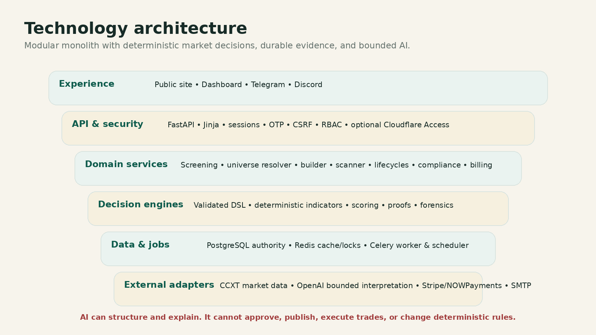

# 🏗️ Technology Architecture

> **Workspace status:** Updated 17 July 2026. Product name: **HilalMarkets**.

## Architecture style

HilalMarkets is an incremental **modular monolith**, not a greenfield rewrite.

- **FastAPI** owns HTTP and API routing.
- **Jinja** renders public and authenticated web pages.
- **PostgreSQL** is authoritative for user, strategy, lifecycle, proof, screening, billing, and audit state.
- **Redis** supports queues, locks, cooldowns, and cache—not sole user state.
- **Celery workers and scheduler** execute asynchronous scans, source monitoring, retries, and lifecycle jobs.
- **CCXT adapters** provide spot-market REST data.
- **OpenAI integration** supports bounded interpretation and factual organization.
- **Telegram and Discord** provide delivery and interaction surfaces.
- **Stripe and NOWPayments adapters** support billing-provider integration.
- **SMTP/outbox records** support durable payment and operational email delivery.

## Domain layers

| Layer | Responsibility |
|---|---|
| API | Validation, authentication context, webhooks, transport errors |
| Core | Configuration, database sessions, security, logging, plans, site content |
| Persistence | Typed entities, relationships, indexes, evidence, audit history |
| Schemas | Validated strategy DSL and API contracts |
| Services | Screening, builder, scanner, lifecycle, compliance, billing, support |
| Engine | Deterministic indicators, evaluation, scoring, risk, proof, forensics |
| Workers | Idempotent scans, source monitoring, expiry, notifications, health |
| Web | Shared HilalMarkets shells, components, accessibility, consent |
| Admin | System Brain governance, product quality, reliability, and audit |

## Key architecture decisions

1. **Immutable Watchlist versions**  
   Editing creates a new version. Activation requires an approved canonical hash and recent preview.

2. **One persistent opportunity instance**  
   A stable setup key tracks lifecycle events instead of generating disconnected alerts.

3. **One Sharia universe resolver**  
   Discovery, one-time checks, Watchlists, workers, and evidence share the same policy authority.

4. **Frozen event evidence**  
   Scans and alerts preserve the exact methodology, publication, universe snapshot, and policy decision used at evaluation time.

5. **Identity separate from ticker**  
   Canonical assets and exact exchange mappings prevent ticker-only errors.

6. **Adapters behind protocols**  
   Market data, AI, notifications, billing, charts, and dispatch are replaceable and testable with fakes.

7. **Billing webhooks are commercial truth**  
   Browser price and entitlement values are ignored.

8. **Application RBAC is authoritative**  
   Cloudflare Access can add an outer gate, but does not replace application authentication and role checks.

## Public information architecture

Implemented public routes include:

- Features
- How It Works
- How We Screen
- Pricing
- Help Center
- Contact
- About
- Trust & Safety
- Risk Disclosure
- Privacy
- Terms
- Cookies

Each public page has unique metadata, canonical URL, social metadata, and relevant structured data. Dashboard, API, and System Brain paths are excluded from public indexing.

## Verification recorded by the repository

The latest implementation report records:

- 1,918 passing repository tests;
- 18 passing Playwright browser tests;
- focused governance, billing, Passport, security, and notification tests;
- JavaScript syntax, compile, lint, targeted type checks, and migration-head verification.

These are repository-recorded results and should still be followed by staging and production smoke tests with real external providers.
