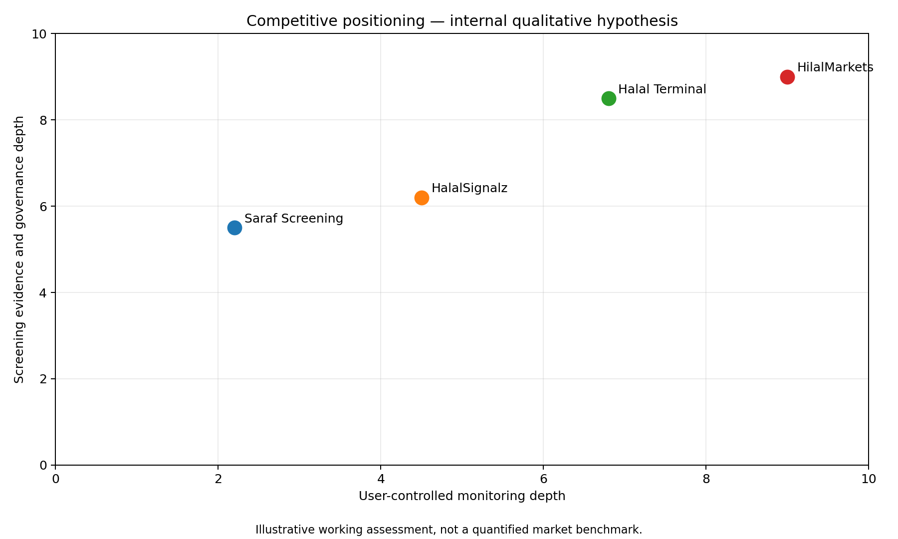

# 🥊 Competitive Landscape

> **Workspace status:** Updated 17 July 2026. Product name: **HilalMarkets**.

> The chart is an internal qualitative hypothesis for strategic discussion. It is not a measured market score.

## Market categories

### Static or research-led screeners
Main job: “Can I consider this asset?”

Strengths:
- simple;
- broad database;
- scholar or framework authority;
- easy mobile discovery.

Weakness:
- users still need charts, custom alerts, monitoring, and status-change operations.

### Prepared signal services
Main job: “What setup should I consider today?”

Strengths:
- immediate action;
- simple entry/stop/target structure;
- low technical burden.

Weakness:
- provider-owned setup;
- more performance and advisory pressure;
- limited user control over mechanics.

### Sharia investment terminals
Main job: “Give me one professional workspace for screening, charts, portfolios, and compliance.”

Strengths:
- broad workflow;
- methodology comparison;
- portfolio features;
- strong professional positioning.

Weakness:
- can become complex for the guided active investor;
- often broader than crypto spot monitoring.

## Current referenced competitors

| Competitor | Current public emphasis | Strategic implication for HilalMarkets |
|---|---|---|
| HalalSignalz | Monthly crypto passlist plus paid structured stock/crypto signals with entry, stop, target, invalidation, and risk notes | Do not compete as another signal provider; emphasize user-owned Watchlists, forming opportunities, immutable evidence, and drift |
| Saraf Screening | Mobile-first crypto Sharia summaries, news, fundamentals, and expert guidance; public store listing shows 10K+ downloads | Proves demand for accessible crypto screening; HilalMarkets must make monitoring and evidence more useful than a static app |
| Halal Terminal | Broad Sharia wealth terminal with charts, five standards, portfolio compliance, DCA, research, API, and 25+ exchanges | Closest platform-level strategic threat; HilalMarkets should remain narrower, guided, crypto-spot-first, and stronger in user-defined monitoring and event evidence |

## HilalMarkets position

> **The guided market-watching platform where screening status, market mechanics, opportunity history, and compliance drift share one evidence system.**

### Differentiation
- Methodology and status are bound directly into the monitor universe.
- Users create their own guided Watchlists rather than consume only provider signals.
- Forming opportunities are visible before a final alert.
- Alert proof preserves the exact Passport used at evaluation time.
- “Why didn’t this alert happen?” covers market, policy, data, and delivery.
- Compliance Drift can pause affected assets and show impact on Watchlists.
- AI cannot publish religious decisions or execute trades.

## Competitive risks

- Broader terminals can add simpler monitoring.
- Established screeners may have stronger scholar trust and larger asset databases.
- Signal services may deliver faster beginner gratification.
- Major exchanges could add an Islamic-finance layer.
- Screening conclusions and methodology rights can be more defensible than interface features.

## Response

HilalMarkets should invest first in:

1. qualified governance;
2. evidence quality and historical integrity;
3. the simplest guided Watchlist workflow;
4. fast first value;
5. reliable delivery and investigation;
6. compliance-drift operations;
7. focused MENA partnerships.

### Official competitor sources
- HalalSignalz: https://www.halalsignalz.com/
- HalalSignalz crypto passlist: https://www.halalsignalz.com/crypto-passlist
- Saraf Screening: https://sarafscreening.com/
- Halal Terminal: https://www.halalterminal.com/product
