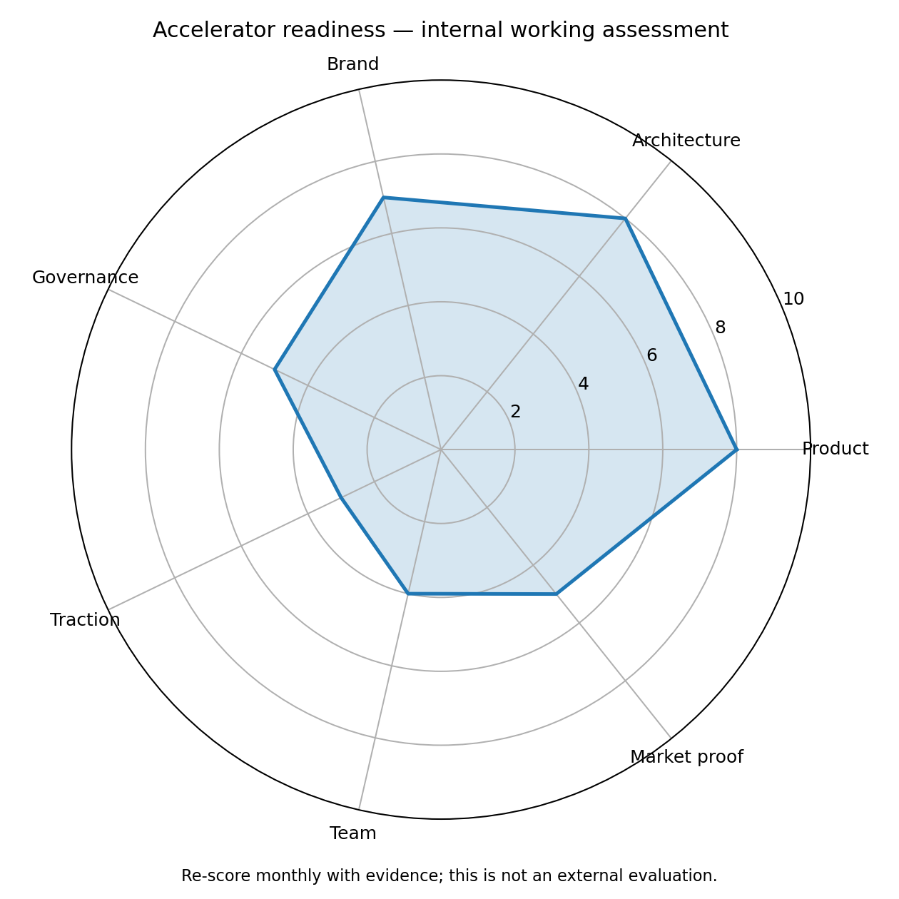

# 🚀 Accelerator and Fundraising Guide

> **Workspace status:** Updated 17 July 2026. Product name: **HilalMarkets**.

> This chart is an internal working assessment. Re-score it monthly using evidence.

## Accelerator objective

Use accelerators for more than cash:

- regulatory and market access;
- qualified governance relationships;
- digital-asset and Islamic-finance partners;
- market-data and exchange partnerships;
- product-market-fit discipline;
- senior hiring and co-founder access;
- investor credibility;
- incorporation and regional operating support.

## Primary target: Hub71+ Digital Assets

### Current official snapshot — 17 July 2026
- Cohort 20 deadline: **2 August 2026**.
- Programme start: **February 2027**.
- Programme duration: **12 months**.
- Package: AED 250,000 flexible in-kind incentives plus AED 250,000 cash in exchange for equity through a SAFE.
- High-performing startups committed to Abu Dhabi may receive an additional AED 250,000 for additional equity.
- At least one founder is expected to commit to relocating long-term and building a team in Abu Dhabi.
- The application requests a PDF deck covering problem, solution, value proposition, business model, competition, market, traction, funds raised, founders, and plans for Hub71/Abu Dhabi.

### Why HilalMarkets fits
- digital-assets infrastructure;
- explainable fintech and RegTech characteristics;
- Muslim-investor and MENA relevance;
- a working product foundation rather than an idea-only application;
- natural partnership opportunities with ADGM, exchanges, banks, investors, and Islamic-finance stakeholders;
- Abu Dhabi can become the regional governance and operating base.

### Hub71 application thesis
Do not pitch “a halal coin list plus technical alerts.”

Pitch:

> HilalMarkets is building the trust and monitoring infrastructure that helps Muslim investors know what assets they can consider, when market behavior matters, and why every status or alert exists.

## Other programmes

### Y Combinator
Current official Fall 2026 on-time deadline: **27 July 2026 at 8pm PT**. The batch runs October–December in San Francisco. YC’s current standard deal is $500,000: $125,000 for 7% plus $375,000 on an uncapped MFN SAFE.

Best timing: after the product shows rapid activation, retention, a clear global category, and an ambitious platform path beyond one region.

### DIFC FinTech Hive / Innovation Hub
Official programme material explicitly includes FinTech, RegTech, and Islamic FinTech, with access to financial institutions, funding, regional market intelligence, and market access.

Best value: Islamic-finance industry partnerships, regulatory context, bank pilots, and MEASA distribution.

### Antler MENAP
The current official MENAP page describes a 10-week full-time in-person residency in Dubai or Riyadh, investing in selected teams and emphasizing founder/team quality. Official regional material describes $180,000 via SAFE for 11% with potential additional uncapped funding, while terms should always be reconfirmed before application.

Best value: team building, co-founder access, intense validation, and pre-seed fundraising. Important consideration: Antler generally prefers complementary teams rather than solo founders after the programme.

## Application evidence required

- A working HilalMarkets demo on HilalMarkets.com.
- A named qualified methodology/governance relationship.
- Reviewed and published pilot Passports.
- Real private-beta activation and retention metrics.
- A documented example of compliance drift affecting a Watchlist.
- A clear competitor map and category thesis.
- Company/IP ownership and incorporation plan.
- Security, privacy, source-rights, and legal readiness.
- A credible founder/team and hiring plan.
- Specific Abu Dhabi or regional economic contribution.

## Recommended deck

1. Vision
2. Problem
3. Product workflow
4. Live product proof
5. Why now
6. Target user
7. Market and expansion
8. Competition and differentiation
9. Business model
10. Traction and beta metrics
11. Trust/governance
12. Technology and moat
13. Go-to-market
14. Team and missing hires
15. Abu Dhabi plan
16. Fundraise and use of funds

## Fundraising narrative

### Now
Pre-seed capital supports governance, product completion, production reliability, Arabic experience, legal/data rights, beta research, and market-entry partnerships.

### Avoid
- claiming a huge TAM without an obtainable segment;
- using the global Muslim population as the only market proof;
- leading with AI;
- presenting software tests as customer traction;
- claiming assets are approved before qualified publication;
- promising revenue before payment and retention evidence.

## Official sources
- Hub71+ Digital Assets: https://www.hub71.com/program/hub71-plus-digital-assets
- Hub71 application: https://www.hub71.com/program/hub71-plus-digital-assets/apply
- DIFC programmes: https://www.innovationhub.difc.ae/accelerators
- Antler MENAP: https://www.antler.co/location/menap
- YC application: https://www.ycombinator.com/apply
- YC deal: https://www.ycombinator.com/deal
