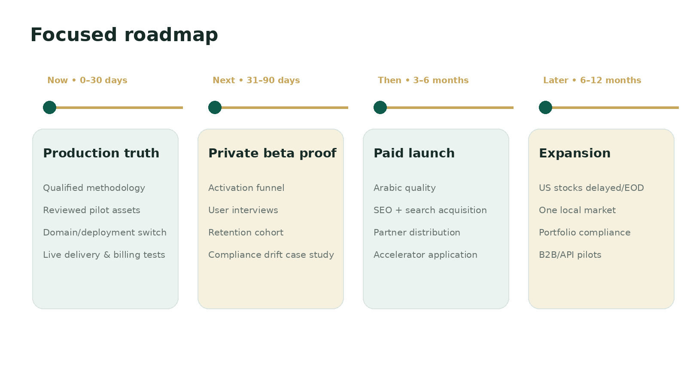

# 🗺️ Roadmap and Priorities

> **Workspace status:** Updated 17 July 2026. Product name: **HilalMarkets**.

## Now — production truth

### Objective
Turn the implemented software into a trustworthy, securely deployed, evidence-complete pilot.

### Required
- HilalMarkets.com production configuration.
- Qualified methodology and governing authority.
- Pilot asset review and publication.
- Cloudflare Access plus origin firewall/tunnel.
- Real provider staging tests.
- Billing provider selection and end-to-end validation.
- Legal review.
- Analytics and Search Console verification.
- Private-beta recruitment.

## Next — private-beta proof

### Objective
Prove the guided active-investor workflow.

### Required evidence
- 20+ complete beta activations.
- Watchlist activation rate.
- median time to activation.
- first-scan and test-alert success.
- Passport engagement.
- seven-day active Watchlists.
- real support themes.
- at least one controlled Compliance Drift case.
- willingness-to-pay interviews.

## Then — paid launch

### Objective
Prove retention and recurring revenue.

### Product
- Arabic quality and RTL.
- onboarding optimization.
- pricing and paywall experiments.
- refined opportunity cards.
- compliance digest.
- partner referral flow.
- stronger analytics and support operations.

### Business
- controlled search campaign;
- adviser and ecosystem partnerships;
- Hub71/DIFC/Antler/YC application where readiness fits;
- initial hires or co-founder gap closure.

## Later — expansion

### US stocks
- delayed or end-of-day data first;
- SEC filing fundamentals;
- explicit data-delay label;
- no intraday scalping claims;
- licensed real-time plan only after demand.

### Local market
- begin with an official Sharia index or qualified reviewed universe;
- official exchange or broker data agreement;
- end-of-day monitoring before intraday;
- own OHLC store and chart layer;
- corporate-action and status-change monitoring.

### Portfolio and B2B
- watch-only holdings;
- compliance drift across owned assets;
- screening/monitoring API;
- approved partner embeds;
- institutional evidence export.

## Deliberately delayed

- automatic trading;
- futures and leverage;
- lending/yield marketplace;
- copy trading;
- generic news feed;
- social community;
- prayer/Zakat/lifestyle utilities;
- mass methodology voting;
- thousands of low-evidence tokens;
- real-time stocks without rights;
- unrestricted AI-created strategies.
